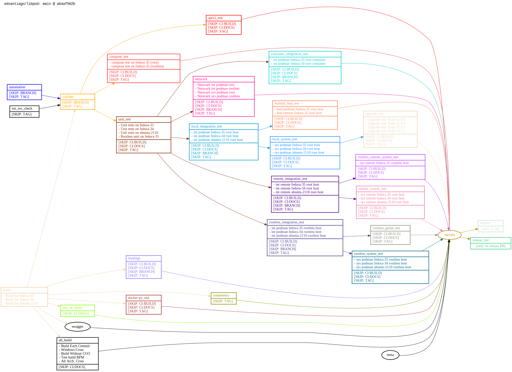

Cirrus task dependencies make my brain spin, so I wrote a quick tool to use [graphviz](https://graphviz.org/) for a simple diagram. Here's what we have as of 2021-08-31, reflecting the "Cirrus 2.0" structure (#6784) plus subsequent fixes.

