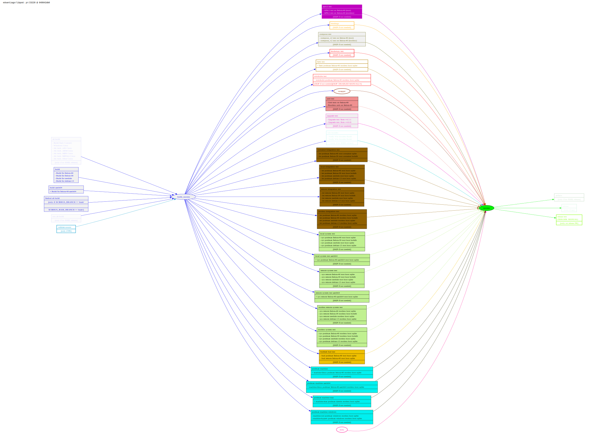

Cirrus task dependencies make my brain spin, so I wrote a quick tool to use [graphviz](https://graphviz.org/) for a simple diagram. Here's what we have as of 2024-02-27, after the giant revamp in #21639:

